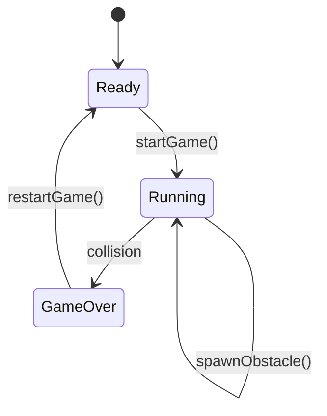
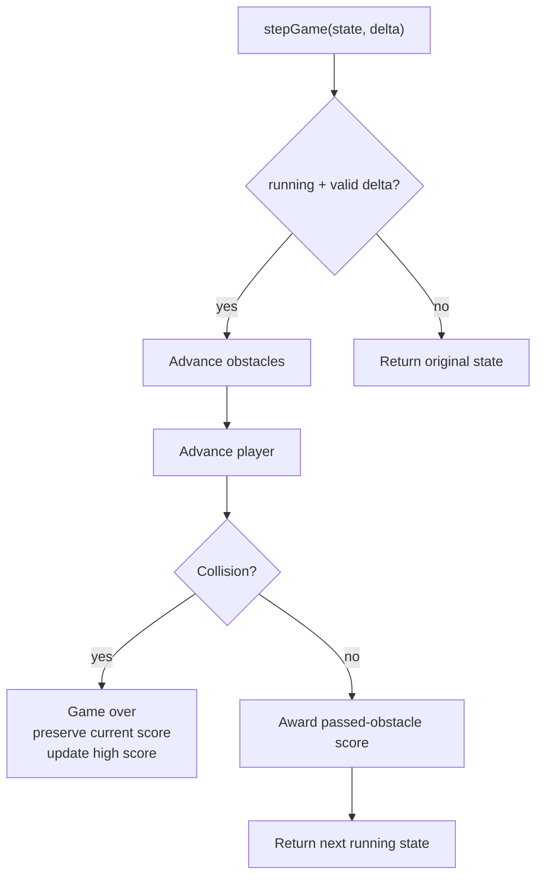

# Not Found Game

A small deterministic runner embedded in the portfolio's 404 experience.

The game is intentionally isolated from the rest of the application. It is an
enhancement to the not-found page, not a dependency of the normal portfolio
experience, and its state remains feature-owned rather than application-global.

## Current Status

- Phase 1 — Deterministic game domain: **Complete**
- Phase 2 — Deterministic obstacle pipeline: **Complete**
- Phase 3 — Runtime integration: **In progress (3/6)**
- Phase 4 — Rendering and controls: **Pending**
- Phase 5 — Lifecycle and accessibility: **Pending**
- Phase 6 — Integration hardening: **Pending**

Progress is tracked against the roadmap below rather than estimated remaining
implementation slices.

## Goals

The feature should:

- provide a lightweight interactive experience on the 404 page;
- remain deterministic and easy to test at the core;
- work with keyboard and touch/pointer input;
- avoid hover-only interaction;
- remain isolated from unrelated application state;
- preserve a session high score across restarts;
- respect reduced-motion and page visibility;
- avoid making the portfolio depend on the game;
- keep randomness and browser timing outside the deterministic domain logic.

## Architecture

```text
apps/web/src/features/not-found-game/
├── frame-clock.ts
├── game-loop.ts
├── game-runtime.ts
├── game-state.ts
├── obstacle-generator.ts
├── obstacle-validation.ts
├── obstacle-spawn-cadence.ts
├── obstacle-spawn-orchestrator.ts
├── obstacle-spawner.ts
├── runtime-spawn-inputs.ts
├── NotFoundGame.tsx
├── NotFoundGame.css
└── README.md

apps/web/tests/
├── fixtures/
│   └── not-found-game.fixture.ts
├── helpers/
│   └── assertions.ts
└── not-found-game/
    ├── frame-clock.test.ts
    ├── game-loop.test.ts
    ├── runtime.test.ts
    ├── state.test.ts
    ├── obstacle-generator.test.ts
    ├── obstacle-spawn-cadence.test.ts
    ├── obstacle-spawner.test.ts
    ├── obstacle-spawn-orchestrator.test.ts
    └── runtime-spawn-inputs.test.ts
```

## Data Flow

```mermaid
flowchart LR
    RAF["requestAnimationFrame<br/>(browser boundary)"]
    LOOP["Game loop"]
    CLOCK["Frame clock"]
    DT["deltaSeconds"]
    RUNTIME["Game runtime"]
    STEP["stepGame()"]
    CADENCE["Obstacle spawn cadence"]
    COUNT["spawnCount"]
    INPUTS["Runtime spawn inputs<br/>id + normalized sample"]
    GENERATOR["Obstacle generator"]
    VALIDATION["Obstacle validation"]
    SPAWN["spawnObstacle()"]
    STATE["GameState"]
    UI["React rendering"]

    RAF --> LOOP
    LOOP --> CLOCK
    CLOCK --> DT

    DT --> RUNTIME
    RUNTIME --> STEP

    STEP --> STATE
    RUNTIME --> CADENCE
    CADENCE --> COUNT
    COUNT --> INPUTS
    INPUTS --> GENERATOR
    GENERATOR --> VALIDATION
    VALIDATION --> SPAWN
    SPAWN --> STATE

    STATE --> UI
```



The runtime boundary produces time, IDs, and random samples. The deterministic
modules consume those values but do not call `Math.random()`,
`requestAnimationFrame()`, timers, or browser APIs directly.

## Responsibility Boundaries

### `game-state.ts`

Owns:

- ready / running / game-over transitions;
- jumping;
- gravity and vertical movement;
- landing;
- obstacle horizontal movement;
- obstacle culling;
- collision;
- scoring;
- session high score;
- restart behavior;
- state-specific obstacle admission.

It does **not** generate obstacles or decide when they become due.

### `browser-game-loop.ts`

Owns the browser-specific adapter for the tested animation loop.

It binds the injected game-loop scheduler to
`globalThis.requestAnimationFrame()` and `globalThis.cancelAnimationFrame()`,
supplies the browser obstacle spawn-input provider, and forwards published
runtime state to the caller.

The scheduler and spawn-input provider remain injectable for deterministic
tests.

This adapter does not itself own the React lifecycle. The browser-animation
roadmap item remains incomplete until `NotFoundGame.tsx` starts and cleans up
the loop.

### `game-runtime.ts`

Owns deterministic advancement of one complete game frame.

A frame:

1. advances existing game physics with `stepGame()`;
2. advances obstacle spawning using the same delta;
3. adds obstacles that became due during that frame.

Newly generated obstacles enter after existing game-state advancement, so they
begin at the configured spawn position and do not move until the next frame.

If game advancement causes a collision, the resulting game-over state prevents
obstacle spawning from consuming cadence during that frame.

The module remains browser-independent. It does not call
`requestAnimationFrame()`, generate random values, or access the DOM.

### `frame-clock.ts`

Owns conversion of browser frame timestamps into bounded simulation deltas.

The first timestamp initializes the clock without advancing the game. Subsequent
timestamps are converted from milliseconds to seconds and clamped to a maximum
frame delta.

This prevents tab suspension, debugger pauses, or unusually slow frames from
causing a giant simulation step.

Invalid, non-finite, duplicate, or backwards timestamps are ignored. Ignoring a
timestamp preserves the existing clock state so malformed input cannot move the
clock backwards or poison subsequent frame calculations.

The clock remains independent of `requestAnimationFrame()` itself.

### `game-loop.ts`

Owns animation-frame lifecycle orchestration.

The loop schedules frame callbacks, passes timestamps through `frame-clock.ts`,
advances `game-runtime.ts` only when a usable delta is produced, publishes the
resulting runtime state, and schedules the next frame.

The scheduler is injected so browser timing remains outside the deterministic
game modules and the lifecycle can be tested without real animation frames.

Stopping the loop cancels its pending frame request and prevents further
advancement.

The loop passes the spawn-input provider through rather than invoking it
eagerly. This ensures IDs and random samples are not generated on frames where
no obstacle spawn is due.

### `obstacle-validation.ts`

Owns reusable structural obstacle validity.

A structurally valid obstacle has:

- a nonblank ID;
- a finite horizontal position;
- a finite positive width;
- a finite positive height.

Duplicate IDs and off-screen spawning remain state-specific rules in
`game-state.ts`.

### `obstacle-generator.ts`

Converts deterministic input into obstacle geometry.

```text
id + normalized sample [0, 1]
              ↓
       generateObstacle()
              ↓
        ObstacleState
```

Current generation configuration:

```text
spawn x        = 12
width          = 1
minimum height = 0.5
maximum height = 1.5
```

The generator rejects blank IDs and normalized samples outside `[0, 1]`,
including non-finite values.

### `obstacle-spawn-cadence.ts`

Tracks elapsed spawn time independently of browser timers.

Current cadence:

```text
1 interval = 1.5 seconds
```

It:

- accumulates elapsed time;
- reports the number of intervals crossed;
- preserves fractional remainder;
- supports multiple due spawns from one large delta;
- ignores invalid/nonpositive deltas.

Example:

```text
3.2 seconds
÷ 1.5 seconds
= 2 spawns due
+ 0.2 seconds remainder
```

### `obstacle-spawner.ts`

Combines cadence with lazily supplied deterministic spawn inputs.

```text
cadence
   ↓
spawnCount
   │
   ├── 0 → do not request inputs
   │
   └── N → request exactly N inputs
                  ↓
          [id, normalizedSample][]
                  ↓
          generated ObstacleState[]
```

The spawner rejects insufficient inputs rather than silently consuming due spawn
events.

The provider is invoked only when cadence reports that at least one obstacle is
due.

### `obstacle-spawn-orchestrator.ts`

Connects generated obstacles to `GameState`.

```text
GameState
   +
SpawnerState
   +
deltaSeconds
   +
lazy spawn-input provider
      ↓
advanceObstacleSpawning()
      ↓
GameState + SpawnerState
```

Generated obstacles enter the game through `spawnObstacle()`, so orchestration
does not duplicate game-state validation.

Spawn cadence does not advance while the game is not running.

### `runtime-spawn-inputs.ts`

Owns the nondeterministic obstacle-input boundary.

The runtime provider generates exactly one obstacle ID and one normalized sample
for each due spawn.

The browser implementation uses:

```text
crypto.randomUUID()
Math.random()
```

Both dependencies remain injectable so the provider can be tested
deterministically.

Because the provider is consumed lazily by the spawn pipeline, IDs and random
samples are generated only when cadence reports that an obstacle is actually
due.

## State Machine



Invalid transitions are ignored and preserve the existing state.

## Coordinate System

```text
                upward
                  ↑
            negative y

              player
             ┌──────┐
             │      │
             └──────┘ ← player.y = feet
────────────────────────────────── ground y = 0
                 obstacle
                 ┌────┐
                 │    │
                 └────┘
```

Rules:

- ground is `y = 0`;
- negative `y` is upward;
- player `y` represents the player's feet;
- player horizontal position is fixed at `x = 1`;
- player width is `1`;
- player height is `1`;
- ground obstacles extend from `-height` to `0`;
- collision uses strict overlap, so touching edges alone does not collide.

## Physics

```text
gravity        = 2
jump velocity  = -1
obstacle speed = 4
```

Player movement uses semi-implicit Euler integration:

```text
velocity += gravity * deltaSeconds
y        += velocity * deltaSeconds
```

Landing clamps to:

```text
y          = 0
velocityY  = 0
isGrounded = true
```

Invalid or nonpositive deltas do not advance the game.

## Collision and Scoring Order



A collision frame intentionally does **not** award score for obstacles that also
pass off-screen during that frame.

## High Score

High score is session-local.

On collision:

```text
highScore = max(current score, existing high score)
```

On restart:

- current score resets;
- player resets;
- obstacles clear;
- game returns to ready;
- high score is preserved.

Persistent storage is intentionally outside the current scope.

## Spawn Rules

`spawnObstacle()` accepts an obstacle only when:

```text
game is running
AND obstacle is structurally valid
AND obstacle is not fully off-screen
AND obstacle ID is not already active
```

An obstacle is fully off-screen when:

```text
x + width <= worldLeftX
```

Partially visible obstacles remain valid.

## Determinism Boundary

### Deterministic core

```text
game-state
game-runtime
frame-clock
obstacle validation
obstacle generation from supplied samples
spawn cadence
spawn orchestration
```

### Runtime boundary

```text
requestAnimationFrame()
cancelAnimationFrame()
frame timestamps
Math.random()
crypto.randomUUID()
keyboard/touch/pointer events
document visibility
prefers-reduced-motion
React state publication
```

The animation loop orchestrates the two sides through injected dependencies
without moving browser APIs into the deterministic domain.

This keeps tests reproducible without making the finished game static.

## Testing Strategy

Focused game tests:

```bash
deno task test:game
```

The task discovers the complete game test directory:

```text
apps/web/tests/not-found-game/
```

Full repository verification:

```bash
deno task verify
```

Coverage may intentionally exist at more than one public boundary while
implementation is shared.

For example:

```text
generateObstacle(blank id)
    → throws

spawnObstacle(manually constructed blank obstacle)
    → ignored
```

Those are different API contracts backed by the same shared validation
invariant.

## Roadmap

### Phase 1 — Deterministic game domain

Status: **Complete**

- [x] Initial ready state
- [x] Start transition
- [x] Jump transition
- [x] Prevent double jump
- [x] Gravity
- [x] Semi-implicit vertical movement
- [x] Landing
- [x] Obstacle movement
- [x] Trailing-edge culling
- [x] Collision detection
- [x] Collision using advanced frame state
- [x] Scoring
- [x] Collision-frame score ordering
- [x] Game-over transition
- [x] Session high score
- [x] Restart
- [x] Preserve high score across restart
- [x] Spawn validation
- [x] Reject duplicate obstacle IDs
- [x] Reject invalid obstacle geometry
- [x] Reject invalid obstacle positions
- [x] Reject blank IDs
- [x] Reject fully off-screen spawn candidates

### Phase 2 — Deterministic obstacle pipeline

Status: **Complete**

- [x] Shared obstacle validation
- [x] Deterministic obstacle generator
- [x] Normalized sample boundaries
- [x] Reject invalid normalized samples
- [x] Deterministic spawn cadence
- [x] Preserve cadence remainder
- [x] Support multiple due spawns
- [x] Reject invalid cadence deltas
- [x] Deterministic spawner
- [x] Reject insufficient spawn inputs
- [x] Multiple generated spawn coverage
- [x] Spawn orchestrator
- [x] Route generated obstacles through `spawnObstacle()`
- [x] Prevent cadence consumption outside running state

### Phase 3 — Runtime integration

Status: **In progress**

- [x] Add deterministic frame orchestration
- [x] Connect the game to the browser `requestAnimationFrame()` lifecycle
- [x] Bound browser frame deltas
- [x] Supply runtime obstacle IDs and random samples
- [ ] Reset runtime state cleanly on restart
- [ ] Prevent stale animation callbacks after unmount

### Phase 4 — Rendering and controls

Status: **Pending**

- [ ] Render player
- [ ] Render obstacles
- [ ] Render ground/world
- [ ] Render current score
- [ ] Render high score
- [ ] Ready-state start control
- [ ] Game-over/restart control
- [ ] Keyboard jump input
- [ ] Touch/pointer jump input
- [ ] Avoid hover-only interactions
- [ ] Verify mobile controls

### Phase 5 — Lifecycle and accessibility

Status: **Pending**

- [ ] Pause advancement while the document is hidden
- [ ] Prevent giant resume deltas
- [ ] Respect `prefers-reduced-motion`
- [ ] Provide appropriate non-motion behavior
- [ ] Avoid keyboard focus traps
- [ ] Use semantic start/restart controls
- [ ] Keep score/status readable
- [ ] Keep the normal 404 escape/navigation path obvious

### Phase 6 — Integration hardening

Status: **Pending**

- [ ] Integrate cleanly with `NotFoundPage`
- [ ] Ensure the 404 page remains usable if the game runtime fails
- [ ] Add focused component/integration coverage
- [ ] Test narrow/mobile layouts
- [ ] Confirm no global state is required
- [ ] Remove temporary/debug behavior
- [ ] Run full `deno task verify`
- [ ] Final cleanup

## Remaining Work Visualization

```text
Phase 1 — Deterministic domain       ██████████  Complete
Phase 2 — Obstacle pipeline          ██████████  Complete
Phase 3 — Runtime integration        ███████░░░  4 / 6
Phase 4 — Rendering / controls       ░░░░░░░░░░  Pending
Phase 5 — Lifecycle / accessibility  ░░░░░░░░░░  Pending
Phase 6 — Integration hardening      ░░░░░░░░░░  Pending
```

## Next Implementation Slice

Make runtime restart reset the complete run, including obstacle spawn cadence,
while preserving the session high score.

Restart should return the game to its ready state with:

- score reset;
- player reset;
- obstacles cleared;
- high score preserved;
- spawn cadence reset to its initial state.

This completes an existing runtime-integration requirement and should not
introduce new persistence or global state.

## Design Constraints

Unless integration proves otherwise:

- keep game state feature-local;
- do not introduce React Context, Redux, or other app-wide state;
- do not persist game state to the backend;
- do not couple portfolio loading to the game;
- keep browser timing/randomness out of deterministic modules;
- prefer small public APIs and feature-owned helpers;
- preserve mobile-first interaction.

## Definition of Done

The feature is complete when:

1. the 404 page can start the game;
2. the player can jump with keyboard and touch/pointer input;
3. obstacles spawn and move from runtime inputs;
4. collisions end the run;
5. score and session high score render correctly;
6. restart cleanly resets the run;
7. hidden-tab/resume behavior cannot create giant simulation jumps;
8. reduced-motion preferences are respected;
9. the page remains usable as a normal 404 experience without playing;
10. focused game tests and the full repository verification pass.
