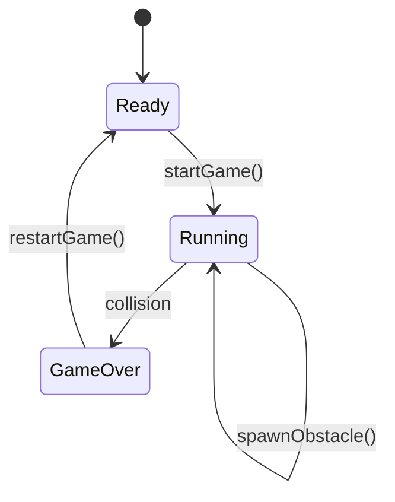
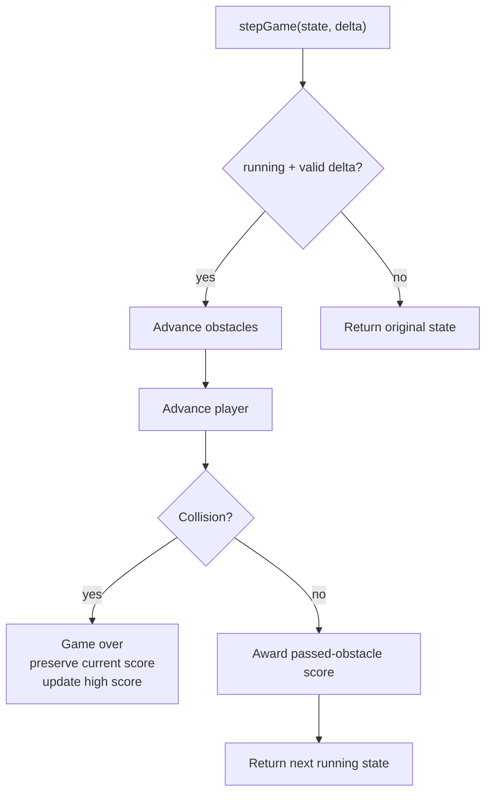

# Not Found Game

A small deterministic runner embedded in the portfolio's 404 experience. The
game is intentionally isolated from the rest of the application. It is an
enhancement to the not-found page, not a dependency of the normal portfolio
experience, and its state remains feature-owned rather than application-global.

## Current Status

- Phase 1 — Deterministic game domain: **Complete**
- Phase 2 — Deterministic obstacle pipeline: **Complete**
- Phase 3 — Runtime integration: **Complete**
- Phase 4 — Rendering and controls: **Complete**
- Phase 5 — Lifecycle and accessibility: **Complete**
- Phase 6 — Integration hardening: **In progress (3/8)**

Progress is tracked against the roadmap below rather than estimated remaining
implementation slices.

## Goals

The feature should:

- provide a lightweight interactive experience on the 404 page;
- remain deterministic and easy to test at the core;
- work with keyboard and touch/pointer input;
- avoid hover-only interaction;
- remain isolated from unrelated application state;
- preserve a session high score across restarts;
- respect reduced-motion and page visibility;
- avoid making the portfolio depend on the game;
- keep randomness and browser timing outside the deterministic domain logic.

## Architecture

```text
apps/web/src/
├── App.tsx
├── lib/
│   └── portfolio-navigation.ts
├── pages/
│   └── NotFoundPage.tsx
└── features/
    └── not-found-game/
        ├── browser-game-audio.ts
        ├── browser-game-loop.ts
        ├── frame-clock.ts
        ├── game-audio.ts
        ├── game-input.ts
        ├── game-loop.ts
        ├── game-motion.ts
        ├── game-runtime.ts
        ├── game-state.ts
        ├── obstacle-generator.ts
        ├── obstacle-validation.ts
        ├── obstacle-spawn-cadence.ts
        ├── obstacle-spawn-orchestrator.ts
        ├── obstacle-spawner.ts
        ├── runtime-spawn-inputs.ts
        ├── NotFoundGame.tsx
        ├── NotFoundGame.css
        ├── PeekingEyes.tsx
        ├── PeekingEyes.css
        └── README.md

apps/web/tests/
├── portfolio-navigation.test.ts
├── fixtures/
│   └── not-found-game.fixture.ts
├── helpers/
│   └── assertions.ts
└── not-found-game/
    ├── browser-game-loop.test.ts
    ├── frame-clock.test.ts
    ├── game-audio.test.ts
    ├── game-input.test.ts
    ├── game-loop.test.ts
    ├── game-motion.test.ts
    ├── game-playability.test.ts
    ├── game-runtime.test.ts
    ├── game-state.test.ts
    ├── obstacle-generator.test.ts
    ├── obstacle-spawn-cadence.test.ts
    ├── obstacle-spawn-orchestrator.test.ts
    ├── obstacle-spawner.test.ts
    └── runtime-spawn-inputs.test.ts
```

## Data Flow

```mermaid
flowchart LR
    RAF["requestAnimationFrame<br/>(browser boundary)"]
    LOOP["Game loop"]
    CLOCK["Frame clock"]
    DT["deltaSeconds"]
    RUNTIME["Game runtime"]
    STEP["stepGame()"]
    CADENCE["Obstacle spawn cadence"]
    COUNT["spawnCount"]
    INPUTS["Runtime spawn inputs<br/>id + normalized sample"]
    GENERATOR["Obstacle generator"]
    VALIDATION["Obstacle validation"]
    SPAWN["spawnObstacle()"]
    STATE["GameState"]
    UI["React rendering"]

    RAF --> LOOP
    LOOP --> CLOCK
    CLOCK --> DT

    DT --> RUNTIME
    RUNTIME --> STEP

    STEP --> STATE
    RUNTIME --> CADENCE
    CADENCE --> COUNT
    COUNT --> INPUTS
    INPUTS --> GENERATOR
    GENERATOR --> VALIDATION
    VALIDATION --> SPAWN
    SPAWN --> STATE

    STATE --> UI
```



The runtime boundary produces time, IDs, and random samples. The deterministic
modules consume those values but do not call `Math.random()`,
`requestAnimationFrame()`, timers, or browser APIs directly.

## Responsibility Boundaries

### `App.tsx` and `portfolio-navigation.ts`

Own application-level route classification for the portfolio entry point.

`portfolio-navigation.ts` normalizes the configured Vite base path and
determines whether the current pathname belongs to the portfolio root. `App.tsx`
uses that shared predicate to render the portfolio at the configured base path
and route unknown paths to `NotFoundPage`.

This keeps deployment-base concerns outside the not-found game feature.

### `NotFoundPage.tsx`

Owns composition of the normal 404 experience.

It combines the immersive `AppShell`, explanatory 404 content, `NotFoundGame`,
and `PeekingEyes`. Navigation remains provided by the shell, so the game is an
enhancement rather than the only way out of the page.

It does not own game physics, runtime state, input interpretation, or browser
timing.

### `game-state.ts`

Owns the deterministic game domain:

- ready / running / game-over transitions;
- jumping;
- prevention of double jumps;
- gravity and vertical movement;
- landing;
- obstacle horizontal movement;
- obstacle culling;
- collision detection;
- scoring;
- session high score;
- restart behavior;
- state-specific obstacle admission;
- core movement constants used by the deterministic physics model.

The movement constants are covered by a focused playability regression so a
correctly timed jump remains capable of clearing generated obstacles.

It does not generate obstacles, decide when they become due, access browser
APIs, or own React state.

### `game-runtime.ts`

Owns deterministic orchestration of the complete runtime state.

A frame:

1. advances existing game physics with `stepGame()`;
2. advances obstacle spawning using the same delta;
3. adds obstacles that became due during that frame.

It also provides feature-level runtime transitions for actions such as jumping
and restarting so the interaction layer does not need to manipulate portions of
runtime state independently.

Restart resets game and spawning state while preserving behavior defined by the
underlying deterministic game transitions.

The module remains browser-independent.

### `frame-clock.ts`

Owns conversion of animation-frame timestamps into bounded simulation deltas.

The first usable timestamp initializes the clock without advancing the game.
Subsequent timestamps are converted from milliseconds to seconds and bounded to
the configured maximum frame delta.

Invalid, non-finite, duplicate, or backwards timestamps do not advance the
simulation.

Resetting the clock before animation resumes prevents time spent suspended from
becoming one large simulation step.

### `game-loop.ts`

Owns animation-frame lifecycle orchestration independently of any specific
browser scheduler.

The loop:

- schedules frame callbacks through injected dependencies;
- passes timestamps through `frame-clock.ts`;
- advances `game-runtime.ts` only when a usable delta exists;
- publishes resulting runtime state;
- exposes feature-owned runtime-state updates;
- supports pausing and resuming;
- resets the frame clock when resuming;
- cancels pending work when paused or stopped;
- prevents stale callbacks from advancing state after cleanup.

The scheduler remains injected so loop behavior can be tested without real
browser animation frames.

### `browser-game-loop.ts`

Owns the browser adapter and safe startup boundary for `game-loop.ts`.

It binds:

- `globalThis.requestAnimationFrame()`;
- `globalThis.cancelAnimationFrame()`;
- the browser obstacle spawn-input provider;
- runtime-state publication.

`tryStartBrowserGameLoop()` contains browser-loop startup failure at this
boundary. If the scheduler cannot start, it returns `null` rather than allowing
the game enhancement to take down the surrounding 404 experience.

The adapter supplies browser dependencies and startup protection but does not
own game rules or React component lifecycle.

### `game-input.ts`

Owns feature-local interpretation of jump input.

It determines whether:

- a keyboard key represents a supported jump command;
- a pointer event represents the primary pointer action.

Keyboard and pointer input ultimately use the same runtime jump transition.

The module does not perform physics or mutate game state directly.

### `game-motion.ts`

Owns the combined lifecycle pause policy.

The game should remain paused when either:

- the document is hidden; or
- `prefers-reduced-motion` requests reduced motion.

Keeping these conditions in one policy prevents one browser event from resuming
the game while another pause condition is still active.

The module contains no browser APIs itself.

### `game-audio.ts`

Owns deterministic identification of meaningful sound events from game-state
transitions.

Current effects are:

- start;
- jump;
- score;
- game over.

It determines which sound event occurred but does not produce audio or access
browser audio APIs.

### `browser-game-audio.ts`

Owns best-effort browser playback of the lightweight 8-bit sound effects.

It uses the browser audio boundary to synthesize short tones and gracefully does
nothing when audio is unavailable.

Audio remains an enhancement. Failure to initialize or play audio must not alter
game behavior.

### `obstacle-validation.ts`

Owns reusable structural obstacle validity.

A structurally valid obstacle has:

- a nonblank ID;
- a finite horizontal position;
- a finite positive width;
- a finite positive height.

Duplicate IDs and off-screen admission remain state-specific rules in
`game-state.ts`.

### `obstacle-generator.ts`

Converts deterministic input into obstacle geometry.

```text
id + normalized sample [0, 1]
             ↓
      generateObstacle()
             ↓
        ObstacleState
```

Current generation configuration:

```text
spawn x        = 12
width          = 1
minimum height = 0.5
maximum height = 1.5
```

The generator rejects blank IDs and normalized samples outside `[0, 1]`,
including non-finite values.

### `obstacle-spawn-cadence.ts`

Tracks elapsed spawn time independently of browser timers.

Current cadence:

```text
1 interval = 1.5 seconds
```

It:

- accumulates elapsed time;
- reports the number of intervals crossed;
- preserves fractional remainder;
- supports multiple due spawns from one large delta;
- ignores invalid or nonpositive deltas.

Example:

```text
3.2 seconds
÷ 1.5 seconds
= 2 spawns due
+ 0.2 seconds remainder
```

### `obstacle-spawner.ts`

Combines cadence with lazily supplied deterministic spawn inputs.

```text
cadence
   ↓
spawnCount
   │
   ├── 0 → do not request inputs
   │
   └── N → request exactly N inputs
                  ↓
           [id, normalizedSample][]
                  ↓
           generated ObstacleState[]
```

The input provider is invoked only when at least one obstacle is due.

Insufficient inputs are rejected rather than silently consuming due spawn
events.

### `obstacle-spawn-orchestrator.ts`

Connects generated obstacles to `GameState`.

```text
GameState
   +
SpawnerState
   +
deltaSeconds
   +
lazy spawn-input provider
      ↓
advanceObstacleSpawning()
      ↓
GameState + SpawnerState
```

Generated obstacles enter through `spawnObstacle()`, so orchestration does not
duplicate game-state validation.

Spawn cadence does not advance while the game is not running.

### `runtime-spawn-inputs.ts`

Owns the nondeterministic obstacle-input boundary.

The browser provider produces exactly one obstacle ID and one normalized random
sample for each due spawn using:

```text
crypto.randomUUID()
Math.random()
```

Both dependencies remain injectable for deterministic tests.

Because inputs are requested lazily, IDs and random samples are generated only
when cadence reports an obstacle is actually due.

### `NotFoundGame.tsx`

Owns React integration for the feature.

It connects:

- React-rendered runtime state;
- the browser animation loop;
- start and restart controls;
- keyboard and pointer jump input;
- document visibility;
- reduced-motion preference changes;
- lightweight sound playback;
- loop setup and cleanup.

It coordinates existing feature modules rather than implementing physics,
collision, spawning, timing, or audio-event rules itself.

If browser-loop startup fails, it keeps the controller unset and leaves the game
in its stable initial state so the surrounding 404 content and navigation remain
usable.

Game state remains local to the feature.

### `PeekingEyes.tsx`

Owns the decorative ambient eye presentation used by the not-found experience.

It is presentation-only and does not affect game state, physics, scoring,
controls, or navigation.

Its motion is disabled for reduced-motion users.

## State Machine



Invalid transitions are ignored and preserve the existing state.

## Coordinate System

```text
                upward
                  ↑
            negative y
              player
             ┌──────┐
             │      │
             └──────┘ ← player.y = feet
────────────────────────────────── ground y = 0
                 obstacle
                 ┌────┐
                 │    │
                 └────┘
```

Rules:

- ground is `y = 0`;
- negative `y` is upward;
- player `y` represents the player's feet;
- player horizontal position is fixed at `x = 1`;
- player width is `1`;
- player height is `1`;
- ground obstacles extend from `-height` to `0`;
- collision uses strict overlap, so touching edges alone does not collide.

## Physics

```text
gravity        = 8
jump velocity  = -6
obstacle speed = 4
```

Player movement uses semi-implicit Euler integration:

```text
velocity += gravity * deltaSeconds
y        += velocity * deltaSeconds
```

Landing clamps to:

```text
y          = 0
velocityY  = 0
isGrounded = true
```

Invalid or nonpositive deltas do not advance the game.

The jump and gravity values are tuned so a correctly timed jump can clear the
tallest generated obstacle (`1.5` world units). Focused playability coverage
protects that relationship from future physics regressions.

## Collision and Scoring Order



A collision frame intentionally does **not** award score for obstacles that also
pass off-screen during that frame.

## High Score

High score is session-local. On collision:

```text
highScore = max(current score, existing high score)
```

On restart:

- current score resets;
- player resets;
- obstacles clear;
- game returns to ready;
- high score is preserved.

Persistent storage is intentionally outside the current scope.

## Spawn Rules

`spawnObstacle()` accepts an obstacle only when:

```text
game is running
AND obstacle is structurally valid
AND obstacle is not fully off-screen
AND obstacle ID is not already active
```

An obstacle is fully off-screen when:

```text
x + width <= worldLeftX
```

Partially visible obstacles remain valid.

## Determinism Boundary

### Deterministic core

```text
game-state
game-runtime
frame-clock
obstacle validation
obstacle generation from supplied samples
spawn cadence
spawn orchestration
```

### Runtime boundary

```text
requestAnimationFrame()
cancelAnimationFrame()
frame timestamps
Math.random()
crypto.randomUUID()
keyboard/touch/pointer events
document visibility
prefers-reduced-motion
React state publication
```

The animation loop orchestrates the two sides through injected dependencies
without moving browser APIs into the deterministic domain. This keeps tests
reproducible without making the finished game static.

## Testing Strategy

Focused game tests:

```bash
deno task test:game
```

The task discovers the complete game test directory:

```text
apps/web/tests/not-found-game/
```

Full repository verification:

```bash
deno task verify
```

Coverage may intentionally exist at more than one public boundary while
implementation is shared. For example:

```text
generateObstacle(blank id)
    → throws
spawnObstacle(manually constructed blank obstacle)
    → ignored
```

Those are different API contracts backed by the same shared validation
invariant.

## Roadmap

### Phase 1 — Deterministic game domain

Status: **Complete**

- [x] Initial ready state
- [x] Start transition
- [x] Jump transition
- [x] Prevent double jump
- [x] Gravity
- [x] Semi-implicit vertical movement
- [x] Landing
- [x] Obstacle movement
- [x] Trailing-edge culling
- [x] Collision detection
- [x] Collision using advanced frame state
- [x] Scoring
- [x] Collision-frame score ordering
- [x] Game-over transition
- [x] Session high score
- [x] Restart
- [x] Preserve high score across restart
- [x] Spawn validation
- [x] Reject duplicate obstacle IDs
- [x] Reject invalid obstacle geometry
- [x] Reject invalid obstacle positions
- [x] Reject blank IDs
- [x] Reject fully off-screen spawn candidates

### Phase 2 — Deterministic obstacle pipeline

Status: **Complete**

- [x] Shared obstacle validation
- [x] Deterministic obstacle generator
- [x] Normalized sample boundaries
- [x] Reject invalid normalized samples
- [x] Deterministic spawn cadence
- [x] Preserve cadence remainder
- [x] Support multiple due spawns
- [x] Reject invalid cadence deltas
- [x] Deterministic spawner
- [x] Reject insufficient spawn inputs
- [x] Multiple generated spawn coverage
- [x] Spawn orchestrator
- [x] Route generated obstacles through `spawnObstacle()`
- [x] Prevent cadence consumption outside running state

### Phase 3 — Runtime integration

Status: **Complete**

- [x] Add deterministic frame orchestration
- [x] Connect the game to the browser `requestAnimationFrame()` lifecycle
- [x] Bound browser frame deltas
- [x] Supply runtime obstacle IDs and random samples
- [x] Reset runtime state cleanly on restart
- [x] Prevent stale animation callbacks after unmount

### Phase 4 — Rendering and controls

Status: **Complete**

- [x] Render player
- [x] Render obstacles
- [x] Render ground/world
- [x] Render current score
- [x] Render high score
- [x] Ready-state start control
- [x] Game-over/restart control
- [x] Keyboard jump input
- [x] Touch/pointer jump input
- [x] Avoid hover-only interactions
- [x] Verify mobile controls
- [x] Add lightweight 8-bit game sound effects

### Phase 5 — Lifecycle and accessibility

Status: **Complete**

- [x] Pause advancement while the document is hidden
- [x] Prevent giant resume deltas
- [x] Respect `prefers-reduced-motion`
- [x] Provide appropriate non-motion behavior
- [x] Avoid keyboard focus traps
- [x] Use semantic start/restart controls
- [x] Keep score/status readable
- [x] Keep the normal 404 escape/navigation path obvious

### Phase 6 — Integration hardening

Status: **In progress**

- [x] Integrate cleanly with `NotFoundPage`
- [x] Ensure the 404 page remains usable if the game runtime fails
- [x] Add focused component/integration coverage
- [ ] Test narrow/mobile layouts
- [ ] Confirm no global state is required
- [ ] Remove temporary/debug behavior
- [ ] Run full `deno task verify`
- [ ] Final cleanup

## Remaining Work Visualization

```text
Phase 1 — Deterministic domain       ██████████  Complete
Phase 2 — Obstacle pipeline          ██████████  Complete
Phase 3 — Runtime integration        ██████████  Complete
Phase 4 — Rendering / controls       ██████████  Complete
Phase 5 — Lifecycle / accessibility  ██████████  Complete
Phase 6 — Integration hardening      ████░░░░░░  3 / 8
```

## Next Implementation Slice

Complete final integration hardening for the not-found game.

The final slice should:

- re-verify narrow and mobile layouts;
- confirm game state remains feature-local and no global state is required;
- remove any remaining temporary or debug behavior;
- run the complete `deno task verify` pipeline;
- perform final implementation and documentation cleanup.

No new gameplay, visual redesign, state architecture, or feature scope should be
introduced during final hardening.

## Design Constraints

Unless integration proves otherwise:

- keep game state feature-local;
- do not introduce React Context, Redux, or other app-wide state;
- do not persist game state to the backend;
- do not couple portfolio loading to the game;
- keep browser timing/randomness out of deterministic modules;
- prefer small public APIs and feature-owned helpers;
- preserve mobile-first interaction.

## Definition of Done

The feature is complete when:

1. the 404 page can start the game;
2. the player can jump with keyboard and touch/pointer input;
3. obstacles spawn and move from runtime inputs;
4. collisions end the run;
5. score and session high score render correctly;
6. restart cleanly resets the run;
7. hidden-tab/resume behavior cannot create giant simulation jumps;
8. reduced-motion preferences are respected;
9. the page remains usable as a normal 404 experience without playing;
10. focused game tests and the full repository verification pass.
